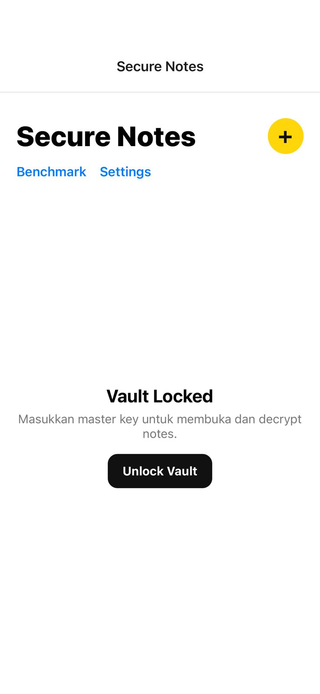
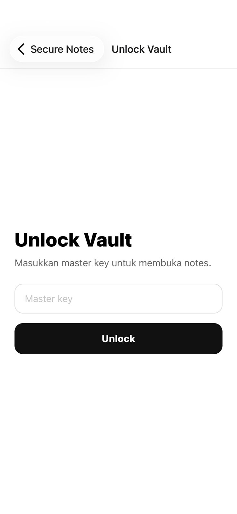
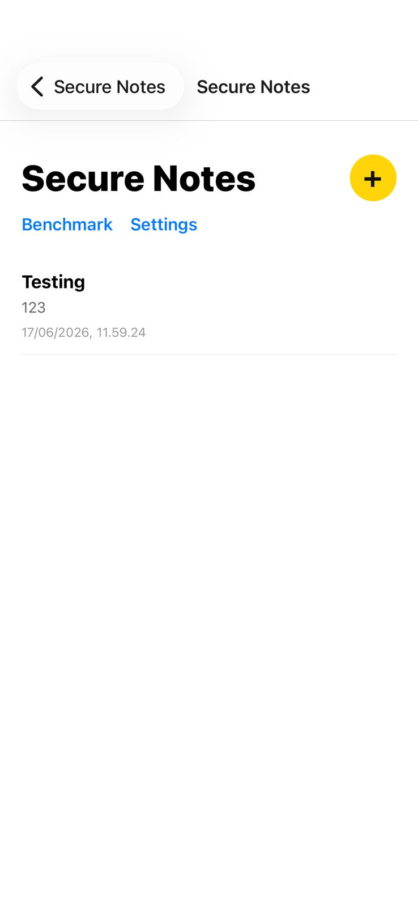
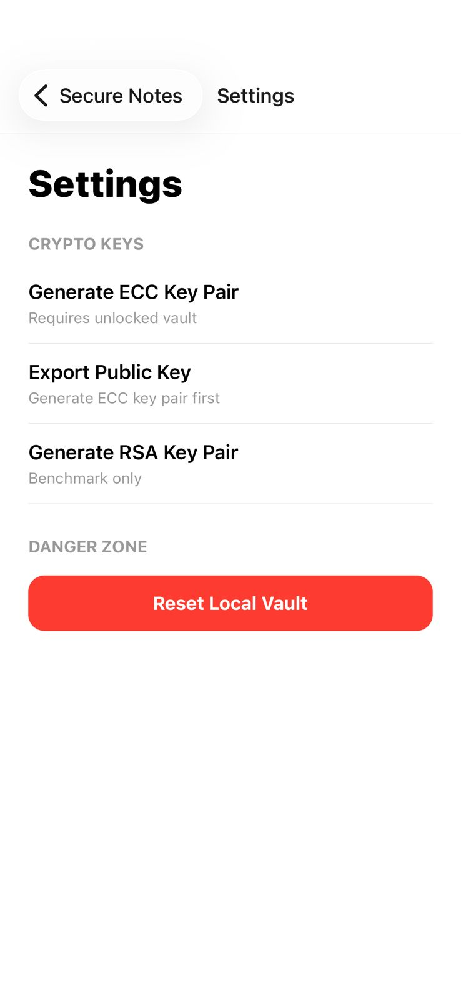
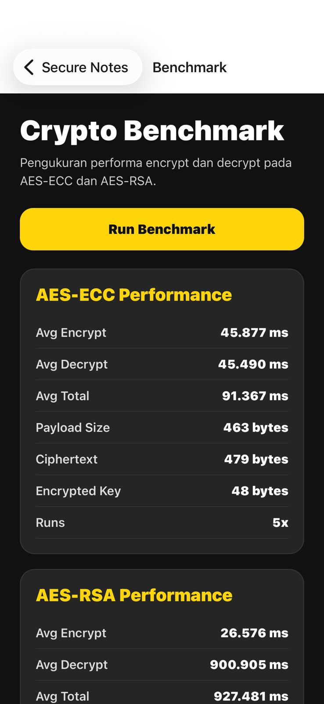
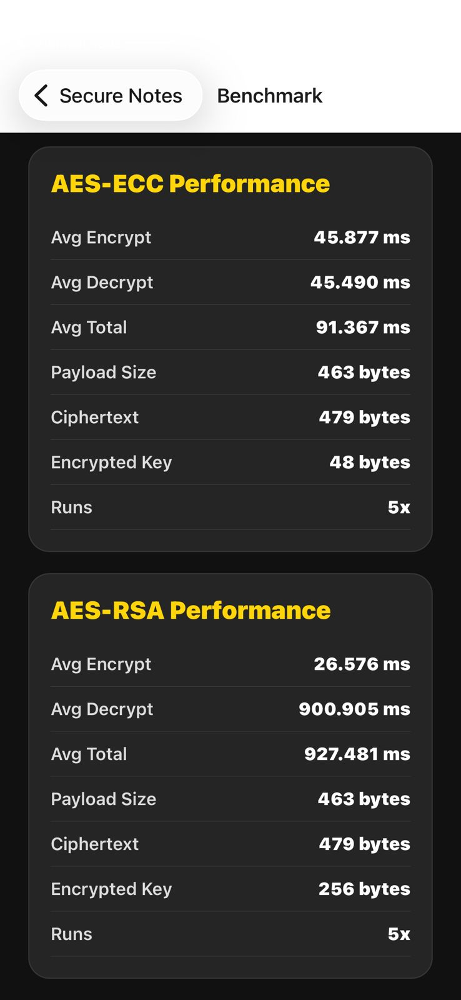

# Secure Notes

Secure Notes adalah aplikasi mobile berbasis Expo React Native untuk menyimpan catatan lokal dengan mekanisme enkripsi. Aplikasi ini menggunakan skema utama **AES + ECC** untuk mengamankan isi catatan, serta menyediakan fitur benchmark untuk membandingkan performa **AES-ECC** dan **AES-RSA**.

## Fitur Utama

- Membuat, menyimpan, dan membuka catatan lokal
- Master key dari user untuk membuka vault
- Enkripsi catatan menggunakan AES
- Pengamanan AES note key menggunakan ECC
- Penyimpanan catatan terenkripsi di SQLite
- Generate ECC key pair
- Export public key
- Benchmark AES-ECC dan AES-RSA
- Reset local vault

## Teknologi

- Expo
- React Native
- TypeScript
- Expo Router
- Expo SQLite
- Expo SecureStore
- Expo Crypto
- Noble Ciphers
- Noble Curves
- Node Forge

## Prasyarat

Pastikan sudah menginstall:

- Node.js
- npm
- Expo Go di HP
- VS Code

Cek versi Node dan npm:

```bash
node -v
npm -v
```

## Cara Menjalankan Project

### 1. Clone atau buka folder project

Masuk ke folder project:

```bash
cd secure-notes
```

Contoh jika folder ada di drive D:

```bash
cd D:\secure-notes
```

### 2. Install dependency

Jalankan:

```bash
npm install
```

Jika ada package Expo yang belum sesuai, jalankan:

```bash
npx expo install --fix
```

### 3. Jalankan project

```bash
npx expo start -c
```

Setelah Metro Bundler terbuka, scan QR menggunakan Expo Go di HP.

## Cara Menjalankan di Web

Jika ingin menjalankan di browser:

```bash
npx expo install react-native-web react-dom @expo/metro-runtime
```

Lalu jalankan:

```bash
npx expo start -c
```

Tekan:

```text
w
```

Catatan: beberapa fitur seperti SecureStore dan SQLite dapat memiliki perilaku berbeda di web dibandingkan di perangkat mobile.

## Alur Penggunaan Aplikasi

### 1. Buka aplikasi

Saat aplikasi dibuka, user akan masuk ke halaman Home.

Jika vault belum terbuka, aplikasi akan menampilkan status:

```text
Vault Locked
```

### 2. Input Master Key

Tekan tombol:

```text
Unlock Vault
```

Masukkan master key minimal 8 karakter.

Jika pertama kali menggunakan aplikasi, master key akan dibuat. Jika sudah pernah dibuat, master key akan divalidasi.

### 3. Membuat Note

Setelah vault terbuka, tekan tombol:

```text
+
```

User akan masuk ke halaman editor note.

### 4. Menulis Note

User dapat mengisi:

- Title
- Body

Catatan akan tersimpan otomatis setelah user berhenti mengetik.

### 5. Membuka Note

Saat note dibuka, aplikasi akan melakukan proses decrypt menggunakan alur AES-ECC.

Jika vault terkunci, user harus memasukkan master key terlebih dahulu.

## Alur Enkripsi Notes

Alur utama aplikasi menggunakan AES-ECC:

```text
User input master key
↓
Master key membuka ECC private key
↓
User menulis note
↓
Generate AES note key
↓
AES encrypt isi note
↓
ECC derive wrapping key
↓
AES note key dienkripsi menggunakan wrapping key hasil ECC
↓
SQLite menyimpan ciphertext dan metadata enkripsi
```

Data yang disimpan di SQLite:

- encryptedTitle
- encryptedBody
- titleIv
- keyIv
- encryptedNoteKey
- ephemeralPublicKey
- cryptoAlgorithm
- createdAt
- updatedAt
- pinned

Plaintext note tidak disimpan langsung di SQLite.

## Alur Dekripsi Notes

```text
User input master key
↓
Master key membuka ECC private key
↓
Aplikasi mengambil encrypted note dari SQLite
↓
ECC private key + ephemeral public key menghasilkan wrapping key
↓
Wrapping key membuka AES note key
↓
AES note key decrypt isi note
↓
Title dan body tampil di UI
```

## Benchmark

Halaman Benchmark digunakan untuk membandingkan performa:

- AES-ECC
- AES-RSA

Cara menjalankan benchmark:

1. Buka halaman Benchmark
2. Tekan tombol:

```text
Run Benchmark
```

3. Aplikasi akan menampilkan dua tabel:

### AES-ECC Performance

Berisi:

- Avg Encrypt
- Avg Decrypt
- Avg Total
- Payload Size
- Ciphertext
- Encrypted Key
- Runs

### AES-RSA Performance

Berisi:

- Avg Encrypt
- Avg Decrypt
- Avg Total
- Payload Size
- Ciphertext
- Encrypted Key
- Runs

## Parameter Kriptografi

### AES-ECC

```text
AES: AES-256-GCM
AES key size: 256-bit / 32 bytes
AES IV: 96-bit / 12 bytes
ECC curve: P-256
ECC private key: 256-bit / 32 bytes
Key exchange: ECDH
KDF: SHA-256 dari shared secret
```

### AES-RSA

```text
AES: AES-256-GCM
AES key size: 256-bit / 32 bytes
AES IV: 96-bit / 12 bytes
RSA: RSA-OAEP
RSA key size: 2048-bit
OAEP hash: SHA-256
MGF1 hash: SHA-256
```

## Settings

Pada halaman Settings tersedia fitur:

### Generate ECC Key Pair

Membuat ECC key pair untuk vault.

Private key disimpan dalam bentuk terenkripsi, sedangkan public key dapat diexport.

### Export Public Key

Menyalin ECC public key ke clipboard.

### Reset Local Vault

Menghapus:

- Notes lokal
- Master key check
- ECC key pair
- Metadata vault lokal

Gunakan fitur ini jika terjadi error decrypt akibat perubahan schema atau data lama.

## Troubleshooting

### 1. Project tidak jalan / dependency mismatch

Jalankan:

```bash
npx expo install --fix
npx expo start -c
```

### 2. Error crypto.getRandomValues must be defined

Pastikan sudah install:

```bash
npx expo install react-native-get-random-values
```

Pastikan file `polyfills.ts` ada di root project:

```ts
import "react-native-get-random-values";
```

Pastikan `app/_layout.tsx` mengimport polyfill di baris paling atas:

```ts
import "../polyfills";
```

### 3. Error metadata enkripsi note tidak lengkap

Biasanya terjadi karena note lama dibuat sebelum mode AES-ECC aktif.

Solusi:

1. Buka Settings
2. Tekan Reset Local Vault
3. Buat master key baru
4. Buat note baru

### 4. Database table is locked

Restart Metro:

```bash
npx expo start -c
```

Jika masih error, tutup Expo Go lalu buka ulang.

### 5. Benchmark RSA terasa lama

AES-RSA menggunakan RSA 2048-bit, sehingga prosesnya lebih berat dibanding ECC, terutama di perangkat mobile.

## Struktur Folder Penting

```text
app/
  index.tsx
  unlock.tsx
  benchmark.tsx
  settings.tsx
  note/
    [id].tsx

components/
  NoteCard.tsx

services/
  db/
    database.ts
    notesRepository.ts
  crypto/
    aes.ts
    cryptoService.ts
    eccKeyService.ts
    benchmarkCryptoService.ts
  secureStore/
    keyStore.ts

types/
  note.ts
  benchmark.ts

utils/
  date.ts
  encoding.ts
  id.ts
  performance.ts
  random.ts
  size.ts
  textSamples.ts
```

## Screenshots & App Flow

This section shows the main screens of **Secure Notes**, including the locked vault state, unlock flow, note list, settings page, and crypto benchmark results. The screenshots demonstrate how the cryptography concept is presented through a simple mobile user interface.

---

### 1. Vault Locked State



The home screen shows the application in a locked state. Before accessing any saved notes, users need to unlock the vault using a master key. This flow is designed to make the security layer clear to users from the beginning.

When the vault is locked, the app displays:

* The main **Secure Notes** title.
* Navigation links to **Benchmark** and **Settings**.
* A clear **Vault Locked** message.
* An **Unlock Vault** button to start the authentication process.

This screen helps communicate that note data is protected and cannot be accessed until the user provides the correct master key.

---

### 2. Unlock Vault Screen



The unlock screen allows users to enter their master key before accessing encrypted notes. The master key acts as the main entry point to decrypt and open the local note vault.

This screen includes:

* A master key input field.
* A simple unlock button.
* Minimal layout to keep the security flow focused and easy to understand.

The goal of this screen is to make the authentication process straightforward while keeping the user aware that the notes are stored securely.

---

### 3. Notes List After Unlock



After the vault is unlocked, users can access their saved notes. The notes list displays the note title, short content preview, and timestamp. Users can also create a new note using the floating action button.

This screen demonstrates the core note-taking experience:

* Viewing existing notes.
* Creating a new note.
* Accessing benchmark and settings pages.
* Showing decrypted note information only after the vault is unlocked.

The note list is kept simple so users can focus on creating and accessing their private notes.

---

### 4. Settings Page



The settings page contains crypto-related key management options and local vault reset functionality. This page separates security configuration from the main note-taking flow so the app remains easier to use.

The settings page includes:

* **Generate ECC Key Pair** for creating ECC keys.
* **Export Public Key** for accessing the generated public key.
* **Generate RSA Key Pair** for benchmark-related testing.
* **Reset Local Vault** in the danger zone to clear local vault data.

This page shows how the app organizes security-related controls in a dedicated section, making advanced features easier to find without disrupting the main user flow.

---

### 5. Crypto Benchmark Overview



The benchmark screen is used to measure encryption and decryption performance for AES-ECC and AES-RSA. Users can run the benchmark directly from the mobile interface by pressing the **Run Benchmark** button.

This feature was added to compare cryptographic performance in a more practical way. Instead of only explaining encryption theoretically, the benchmark screen shows measurable results such as encryption time, decryption time, total processing time, payload size, ciphertext size, encrypted key size, and number of runs.

---

### 6. Benchmark Result Comparison



The benchmark result screen compares AES-ECC and AES-RSA performance using the same payload size and number of runs.

| Metric               |   AES-ECC |    AES-RSA |
| -------------------- | --------: | ---------: |
| Average Encrypt Time | 45.877 ms |  26.576 ms |
| Average Decrypt Time | 45.490 ms | 900.905 ms |
| Average Total Time   | 91.367 ms | 927.481 ms |
| Payload Size         | 463 bytes |  463 bytes |
| Ciphertext Size      | 479 bytes |  479 bytes |
| Encrypted Key Size   |  48 bytes |  256 bytes |
| Runs                 |        5x |         5x |

Based on this benchmark result, AES-ECC produced a smaller encrypted key size and significantly lower total processing time compared to AES-RSA in this test. AES-RSA showed faster average encryption time, but its decryption time was much higher, resulting in a larger total processing time.

These results highlight why performance measurement is important when implementing cryptographic features in a mobile application. Security features need to be not only technically correct, but also efficient enough for real user interaction.

> Note: Benchmark results may vary depending on the device, runtime environment, payload size, and number of test runs.

---

## Screenshot Summary

| Screen            | Purpose                                                                      |
| ----------------- | ---------------------------------------------------------------------------- |
| Vault Locked      | Shows that notes are protected before the vault is unlocked.                 |
| Unlock Vault      | Allows users to enter the master key to access encrypted notes.              |
| Notes List        | Displays saved notes after successful unlock.                                |
| Settings          | Provides crypto key options and local vault reset.                           |
| Crypto Benchmark  | Measures AES-ECC and AES-RSA encryption/decryption performance.              |
| Benchmark Results | Compares processing time and encrypted key size between AES-ECC and AES-RSA. |

Overall, these screens show how Secure Notes combines mobile development, local encrypted storage, and cryptographic performance comparison into one functional mobile application.


## Catatan Keamanan

Project ini menggunakan master key input user sebagai akses vault. Pada implementasi demo, proses derivasi key menggunakan SHA-256. Untuk implementasi produksi, disarankan menggunakan KDF yang lebih kuat seperti:

- PBKDF2
- Argon2
- scrypt

dengan salt dan jumlah iterasi yang tinggi.

## Ringkasan

Secure Notes menggunakan AES-ECC sebagai algoritma utama untuk melindungi catatan. AES digunakan untuk mengenkripsi isi note, sedangkan ECC digunakan untuk melindungi AES note key. AES-RSA hanya digunakan sebagai pembanding pada fitur benchmark.
